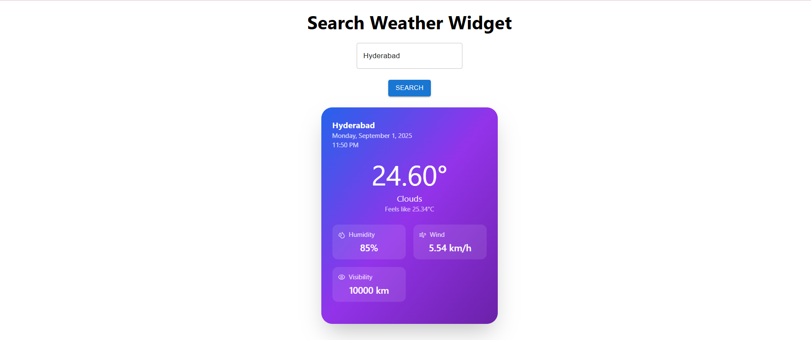

Weather Widget App

A simple and elegant React Weather Widget built with React, Material UI, TailwindCSS, and Lucide Icons.
It fetches real-time weather data from the OpenWeatherMap API and displays essential details like temperature, humidity, wind speed, and visibility in a beautifully styled card.

🚀 Features

🔍 Search weather by city name

📅 Displays current date & time (auto-updates every second)

🌡️ Shows temperature, feels like, max & min temperature

💧 Humidity, Wind speed, and Visibility info

🎨 Modern UI with Material UI + Tailwind CSS

💾 Stores last fetched data in localStorage

🛠️ Tech Stack

React 19 (Frontend framework)

Material UI (MUI) (UI components)

Tailwind CSS (Styling)

Lucide React (Weather-related icons)

OpenWeatherMap API (Weather data source)

📦 Installation

Clone the repo and install dependencies:

git clone https://github.com/your-username/weather-widget.git
cd weather-widget
npm install

▶️ Usage

Start the development server:

npm start

Open in browser:

http://localhost:3000

🔑 API Setup

This app uses the OpenWeatherMap API.

Create a free account at OpenWeatherMap.

Get your API key.

Replace the API_KEY inside SearchComponent.js with your key:

const API_KEY = "YOUR_API_KEY_HERE";

📷 Screenshots

🗂️ Project Structure
weather-widget/
│── src/
│   ├── components/
│   │   └── SearchComponent.js
│   ├── App.js
│   ├── index.js
│   └── styles.css
│── package.json
│── README.md

📌 Future Improvements

🌍 Add support for multiple cities

📊 5-day weather forecast

📱 Responsive design for all devices

🕵️ Better error handling for invalid city names

🤝 Contributing

Contributions, issues, and feature requests are welcome!
Feel free to open a PR or an issue.

📜 License

This project is licensed under the MIT License.